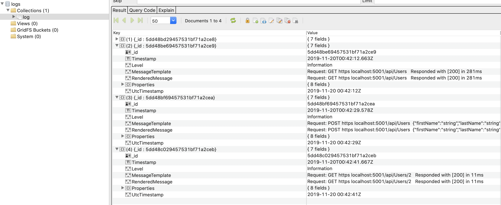
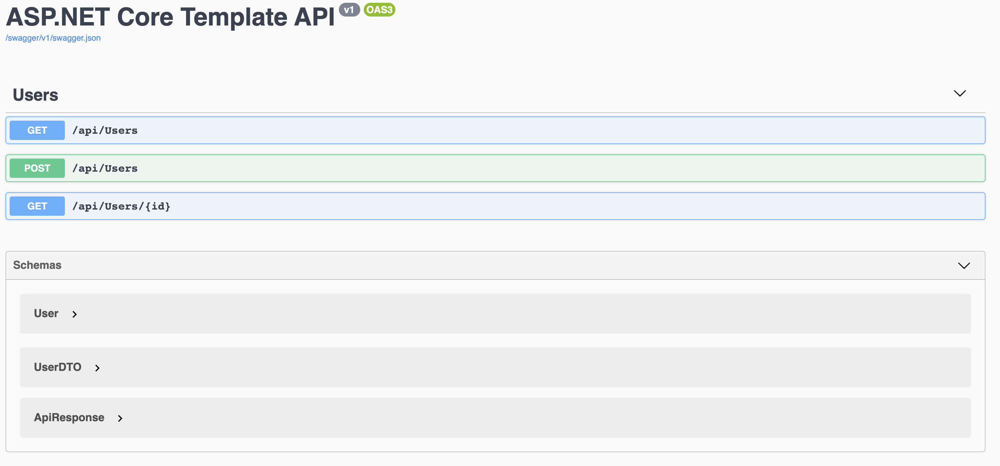

# .NET Core Web API Starter Template

## Table of contents
* [General info](#general-info)
* [Technologies](#technologies)
* [Architecture](#architecture)
* [Setup](#setup)
* [MongoDB](#mongodb)
* [Jwt Authentication](#jwt-authentication)
* [Test API](#test-api)

## General info
This project is intended to provide core functionality for a .NET Core Web API using sound (albeit opinionated) architecture and popular NuGet packages used in modern .NET Core API development.
	
## Technologies
Project is created with:
* .NET Core 3.0 (based on [ApiBolierPlate](https://github.com/proudmonkey/ApiBoilerPlate))
* AutoWrapper
* AutoMapper
* FluentValidation
* Scrutor
* Serilog
* Swashbuckle

## Architecture
This starter template follows the onion architecture, although it is opionated in structure.

The onion architecture promotes loose coupling and abstracting between domain, repository, and service layers.

From the API, the hierarchy is as follows:

API --> Service --> Repository --> Domain

We can describe the advantage of this architecture by spelling out the hierarchy from bottom up:

> Domain objects represent the database objects.

>The Repository layer has intimate knowledge of the objects and the data access rules necessary to translate the objects from the underlying data source.

>The Service layer interacts with the Repository layer (via interfaces) to perform business logic on the data to then present upward.  The Service layer may also call other services (via interfaces).

>The API Controllers serve as the Infrastructure layer, and generally call the Service layer (via interfaces).  The API Controllers can call the Repository layer (via interfaces) but this is only if there is little to no business logic applied.  General rule of thumb is to keep controller logic as light as possible... handle request, prepare response and status code.

For more information on the onion architecture, see [Understanding Onion Architecture](https://www.codeguru.com/csharp/csharp/cs_misc/designtechniques/understanding-onion-architecture.html)
	
## Setup
Build the template on your local machine, from the root project

```
$ dotnet new -i .
```

The template is installed with shortname 'vbswebapi'

Now you can create your own project with your own namespace (based on the -n name).  All folders, projects, and namespaces will use the name specified as the prefix.

```
$ dotnet new vbswebapi --help
```

```
VandenBrink Software Starter Web (C#)
Author: Steve VandenBrink
Options:                                                                              
  -mdb|--useMongoDB  Sets up MongoDB with structured logging and boilerplate   
                     bool - Optional                                           
                     Default: false / (*) true                                 

  -jwt|--useJwt      Sets up Jwt middleware and hash/salt utilities boilerplate
                     bool - Optional                                           
                     Default: false / (*) true    
```

For example, if you want to create a new project with the RootNamepace as 'MyProject', run the following

```
$ dotnet new vbswebapi -n MyProject
```

Then navigate to the MyProject folder created, inspect the code, and now all files are prefixed with the given namespace.

For example, Startup.cs in the API project is in namespace MyProject.API.

Make sure that after the project is created you perform:

```
$ dotnet restore
```

## MongoDB

If you want to create a project that contains infrastructure for MongoDB, both for the backing data store AND structured logging, then use the --useMongoDB flag.

Example

```
$ dotnet new vbswebapi -n MyProject --useMongoDB
```

Example of Structured Logging in logs collection:



Take a look at the different appsettings which now have boilerplate for MongoDBSettings.  The name specified in the -n flag will be used as application name, but you can change it to your liking.

```json
"MongoDBSettings": {
    "ApplicationName": "MyProject",
    "Server": "localhost",
    "Port": "27017",
    "Timeout": 120,
    "Admin": "",
    "Password": ""
  }
```

When you specify to use Mongo, then the controller and automapper profiles will use User from MyProject.Entities/Domain/Mongo.

A [MongoDocument("users")] attribute is placed on User so that the collection name in the database is called 'users'.

Also look at the repository (concrete class and interface) to see common CRUD operations utilizing async methods on IMongoDatabase.

Example of 'users' collection:

## Jwt Authentication

If you want to create a project that has infrastructure for Jwt authentication, then use the --useJwt flag.

When combined with the --useMongoDB flag, you have access to a full repository implementation that will register a user to the backing Mongo database and when logging in as that user you will receive a token with a few claims.

Please note that when jwt is used the [Authorize] attribute is placed on the UsersController and testing in Swagger will no longer work at this time.

A postman collection is contained in the repo so that you can import and use to test endpoints with authentication (using Bearer).

## Test API

Run the project

```
$ dotnet run
```

Open a web browser at localhost:5000/swagger



### Get Users

Try out and execute GET /api/Users

If you are not using MongoDB:
You will get a 200 response with 1 user returned

If you are using MongoDB:
You will get a 200 response with the users returned from the 'users' collection (may not yet exist)

### POST New User

Try out and execute POST /api/Users

Update the request JSON body to your liking.

If you are not using MongoDB:
You will get a 200 response with 1 user returned including a dummy ID that the server might generate from the backing database.

If you are using MongoDB:
You will get a 200 response with the user returned and an ObjectId (_id) set.

Additionally, try empty strings or deleting properties in the JSON body entirely.  You will get a 400 type response with a list of validation errors (this is FluentValidation at work!).

### GET Specifc User

Try out and execute GET /api/Users/{id}

If you are not using MongoDB:
You will get a 200 response with the desired user returned with that id.

If you are using MongoDB:
You will get a 200 response with the desire user returned from the 'users' collection.
